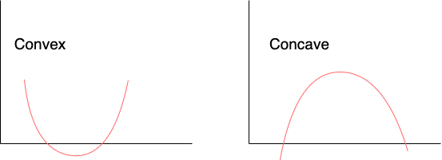
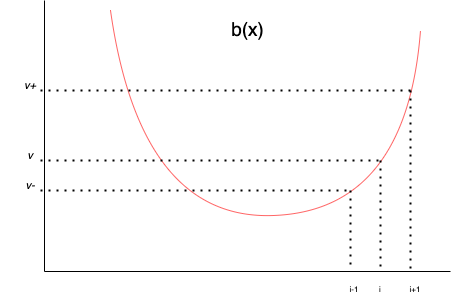
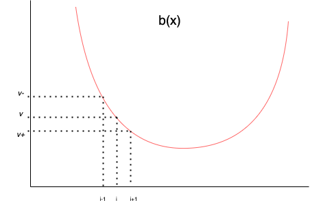

# Ternary search, an introduction

## Intro

Hi!

My name is Brigt and I am at the time of writing completing my 3. semester of an Algorithms master. The topic of this blog post will be one of my favorite algorithms, namely Ternary Search. 


In what follows we will discuss the what, why, when and how of Ternary Search. We will start off by describing what Ternary Search is. This will be an overview of what the algorithm aims to do. We will then look at why one uses this technique, and what it offers. Next, we look at when to use Ternary Search and some of the traits a problem solvable by Ternary Search usually has. We will then end this blog post by discussing an implementation of Ternary Search.

After the technical description of Ternary Search a problem list from Kattis will be given, and you are encouraged to try to solve these problems with your new knowledge of Ternary Search!


## What is Ternary Search
Ternary Search is simplest described as an extension of Binary Search, and we will therefore start with a brief description of Binary Search. 

#### Binary Search
Binary Search is – as the name implies – a search algorithm. We want to check if a value we are looking for exists in a span of sorted values. In its most basic form, this is like searching for a number in a sorted list of numbers. 

Given the list A =[-10,-4,3,0,4,7,22], we can try to look for a number X. We could try to check all values of A and compare all to X, and if we find a match say that X is in A. This would take O(n) time. However, it is possible to use Binary Search instead! With Binary Search we try to exclude as many values as possible at all times and narrow down the space of possible values matching X. 

Binary Search algorithm (log(N):
```{python}
def BinarySeach(A, X):
    n = len(A)# The size of the list
    
    # We are trying to narrow down an interval where X might be.
    h = n #exlusive upper bound
    l = 0 #inclusive lower bound
    while ( l+1<h):
        m = (l+h)//2 # by looking at the middle of high and low we guarantee cutting 
                     # down the interval by half. 
        y = A[m]
        if X == y:
            return True # We found the value we are looking for
        elif y > X:
            # Since y > X, so is A[m+1], A[m+2], ..., A[n-1], as the list is sorted
            # We therfore conclude that the index holding X is located between
            # l and m-1
            h= m
        else: #y < X
            # Since y < X, so is A[m-1], A[m-2],..., A[0], as the list is sorted
            # We therfore conclude that the index holding X is located between
            # m and h
            l = m
        
    return A[l] == X

A =[-10,-4,-3,0,4,7,22]
print(BinarySeach(A, 0))# == True
print(BinarySeach(A, 3))# == False
```

So the Binary Search algorithm exploits the fact that it can exclude all elements larger than y, if y>X – and reversed if y<X.

Note that we could look at A as a function f(x) = x, and the elements in the list A are a subset of values from this function. In fact, all functions with f'(x) = c, for some constant you could use binary search in a similar fashion as described above.

#### Ternary Search?

We are now hopefully ready to look at Ternary Search.
The main idea with Ternary Search is to find a minimum value in a convex graph – f'(x) > 0 for all x. (We could also find maximum in a concave graph by inverting the examples and explanations given here).



Below we will discuss list as "convex functions", for the most part its sufficent to imagen a plot of the values creating a convex function. The formal definition will be given in the end of this chapter.


So how do we find a minimum value? Lets say we have a list B = [10,8,4,6,11,30]. The simplest attempt to find the minimum value would be to look through the list and keep track of the minimum element. This gives a run time of O(n). However, if the dataset is convex we can do better with Ternary Search, aiming for a O(log n) runtime.

To achive this we exploit the properties of convex functions. If we are given a point $i$, we can look at the three values $v$=B[$i$],$v-$ =B[$i$-1], $v+$ =B[$i$+1].
As the function is convex it only has one local and global minimum and we therefore try to move towards it. For any point $i$, either $v-$<$v$<$v+$ or $v+$<$v$<$v-$, unless $v$ is the global minimum, in which case $v$ < $v+$ and $v$ < $v-$.

If $v-$<$v$<$v+$ we know that the global minimum is between $0$ and $i-1$.





On the other hand, if $v+$<$v$<$v-$, we know that the global minimum is between $i+1$ and $n-1$.





By iteratively picking a new $i$ inside the range containing the global minimum and applying the rules above, one would find the global minimum.

To take a step back I would like to point out a rather fun connection between Ternary Search and Binary Search. Whereas Binary Search searches for a value X in a given number space f(x), Ternary Search searches for a global minimum, which in fact is the same as looking for 0 in f'(x). Some might therefore say Ternary Search is Binary Search on the derivative of the original search function.


As promised we know give a formal definition on what is a "convex list" – e.g. we can use Ternary Search.

0. Let our list be F, and the minimum value be F[x].
1. F needs to be contained between to end points, A and B.
2. For all a,b – A <= a < b <= x, F[a] > F[b]
3. For all a,b – x <= a < b <= B, F[a] < F[b]

!!!! TODO: Add something about continous functions and Ternary Search!!!!
## Why use Ternary Search?
The short answer is beacuse its fast, O(log n) compared to O(n) for bruteforce. But to give a bit of insight into how fast it is we can compare it to the bruteforce search. Given a list of size n, how long time would the bruteforce algorithm use compared to Ternary Search?

Below are some datapoints collected on this. Note that this was done on a 4 year old Mac using python, and other programs could get different run times. However the order of difference should stay the same across OS and implementations.

Size of List | Ternary Search | Bruteforce
--- | --- | ---
10 | $7*10^{-6}$s | $9*10^{-6}$s
$10^2$ | $1*10^{-5}$s | $9*10^{-5}$s
$10^3$ | $6*10^{-5}$s | $9*10^{-4}$s
$10^4$ | $3*10^{-5}$s | $6*10^{-3}$s
$10^5$ | $1*10^{-4}$s | $6*10^{-2}$s
$10^6$ | $6*10^{-5}$s | $5*10^{-1}$s
$10^7$ | $7*10^{-5}$s | $6*10^0$s
$10^8$ | $8*10^{-3}$s | $1*10^2$s

Suppose now you had a program doing some task, and inside your program you need to make a call to a subroutine finding the minimal element in a convex list. Lets say your program makes 10'000 such calls before finishing, and that the rest of the code in total takes \~30s to run. If the list size was of the order of $10^7$, and you were to use the bruteforce method this would take you $10^4*6s+30s=60030$\~$=1000min=16h$ and $40min$. Compared to using Ternary Search taking only $10^4*7*10^{-5}s+30s=30.7s$.


## When to use Ternary Search?
As described in the ```what``` chapter, we use Ternary Search to find minimal values from lists. However the problems at hand rarely state "find minimal value in this convex function/list". 

On of the things to be on the lookout for is if the data you are given has an underlaying convex graph. Lets now look at an example of this.

Anni and Bob are having a race. Anni is much faster than Bob – in fact, at any instance Anni is always running faster then Bob – so she is giving him a headstart of 10 seconds. Given two list containing the position of Anni and Bob at each timestamp, find the timestamp where Anni catches up to Bob. 

In this example, the function describing the distance between Anni and Bob will be a convex function, as it will stricly decrease when Anni is behind, and srticly increase when Anni is ahead.

Another example could be a I/O problem. You are to make some pizza and you want to figure out how many pepperonies your customers wants on their pizza. You know that each customer wants the same amount of pepperonies with in the same day – however between days its totally random. A customer will alywas tip more the closer you are on their desired number of pepperonies.

In this second example the amount of tip creats a convex function. Compared to the first example, the second follow a more genral structure. If you are looking for a "correct amount" etc, and you have an oracle – IO / a function / method etc – to say how well you score on each insance (better score for closer instance), Ternary Search can be used to solve the problem fast.

Also note that 